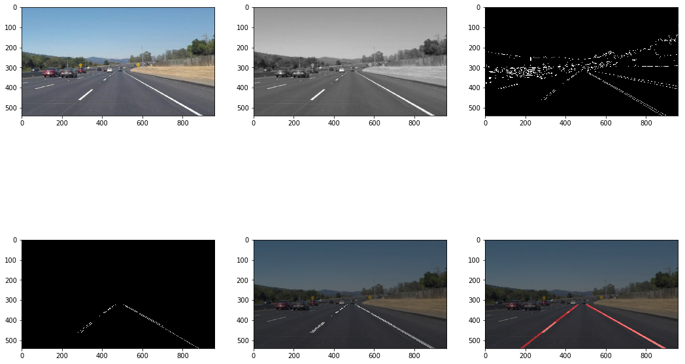

## **Finding Lane Lines on the Road**

Author: David Escolme
Date: 22 January 2018

The goals / steps of this project are the following:

+ Make a pipeline that finds lane lines on the road
+ Reflect on the work in a written report (this document)

### Reflection

### 1. Creating and modifying the pipeline to detect lane lines on images and videos

The initial pipeline consisted of 6 steps - all with default parameters which for the supplied images created reasonable output:

+ The base color image or video frame is converted to grayscale for the canny function
+ The grayscale image has a gaussian blur applied to reduce image noise for edge detection
+ The blurred image is then passed into the Canny edge detection function
+ This function detects edges by finding changes in pixel intensity (the gradient) across the image
+ It then rejects pixels which are below a `low_threshold` value
+ It then rejects pixels which are between the `low_threshold` and `high_threshold` value and are not connected to pixels that are greater than the `high_threshold` value
+ A region of interest is then applied to the Canny image, which limits the detected edges down to a polygon which represents the extent of the likely lanes
+ The masked, edged image (all detected edges on the image / frame within the region of interest) is passed into the hough transform function which detects line segments from the edges using a number of parameters to optimise the selection:
    + Rho, theta: the transform from 'normal' to 'hough' space
    + Threshold: the minimum number of intersections to detect a line
    + Min_line_length: minimum number of pixels in a line
    + Max_line_gap: maximum number of pixels between segments to detect a line
+ The lines detected by the hough transform are then added to the image

The result of this pipeline an image showing detected line segments in the region of interest.

To make the pipeline more useful, it was necessary to extraplotate the detected line segments to create a single left and single right lane line set. This was achieved by changing the `draw_lines()` function to:

+ Separate line segments into an array of negative and and an array of positive gradients - achieved by taking the slope of each line segment, appending to the correct array and then taking a weighted average of the line segments to create a single negative and single positive line
+ Take each single line and then extrapolating the line to fit the bounds set by the bottom of the image and roughly 60% of the 'y' size of the image

This allowed the line lanes to be drawn as 2 single lines (left and right) and for the single frames worked well. The results for the static images should also be visible in the notebook that accompanies this report.

When applied to the videos, however, the results were less good as each line 'jittered' from frame to frame. The approach to solve this was to smooth the lines between frames by maintaining a buffer of the last N detected lines and then averaging over the length of the buffer. The value of N chosen was 24.

Finally, when applied to the challenge video, the pipeline was not able to detect lines successfully. This in part was due to the region of interest not being optimal for the video clip and in part by there being 'more noise' when detecting the line segments coming from:

+ Shadows on the lane lines
+ Cars on the right of the car also being detected within the region of interest
+ Lines not being visible on the road for reasonably long times (>1s)

Despite adjusting the region of interest, the output of the pipeline was still quite poor.

As a stretch project, local videos were recorded of roads in South East London on a very wet day - these videos also highlighted the difficulty in dealing with imperfect road conditions.

### 2. Identify potential shortcomings with your current pipeline

There are a number of shortcomings of the pipeline:

+ An absence of lane markings render the pipeline inoperative - this absence can be caused by dirt on the side of the road, snow, other cars obscuring the lines, etc
+ The region of interest is fixed for each 'car' (video or image) - as road conditions change (curves/corners, roundabouts, turns, road slope, road width) then the pipeline will struggle to find lanes consistently
+ The approach to finding lanes relies on straight-line detection which will struggle with curved road lanes
+ Weather conditions can also disrupt the pipeline - if windscreen wipers are active (and the camera has them in its field of view) then they will cause spurious lines in the region of interest
+ Additional lane markings between the left and right lane will add noise to the detected lanes, disrupting the final lane lines drawn

### 3. Suggest possible improvements to your pipeline

Potential improvements to the pipeline would be to:

+ Detect the extent of the lanes (the outermost left and right lanes detected) and ignore any intra-lane markings
+ Detect curves as well as straight lines to cope with bends in the road